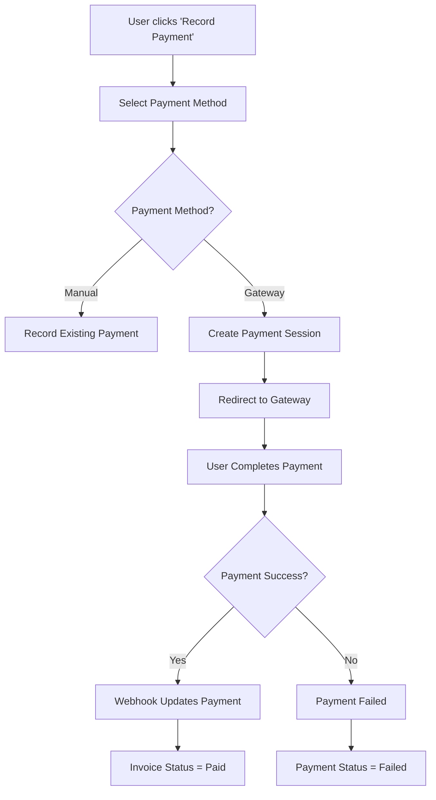

# Payment Gateway Integration

This invoice platform supports multiple payment gateways for processing payments automatically. When a payment is successful, it's automatically recorded and the invoice status is updated to "Paid".

## Supported Payment Gateways

### 1. Stripe
- **Best for**: Global payments, credit/debit cards
- **Features**: PCI compliant, instant processing, global support
- **Setup**: Requires Stripe account and API keys

### 2. Flutterwave
- **Best for**: African markets, local payment methods
- **Features**: Bank transfers, mobile money, local cards
- **Setup**: Requires Flutterwave account and API keys

### 3. M-Pesa
- **Best for**: Kenya mobile payments
- **Features**: STK Push, instant settlement
- **Setup**: Requires Safaricom developer account

## How It Works

1. **User selects payment method** in the payment modal
2. **System creates payment session** with the chosen gateway
3. **User is redirected** to the secure payment gateway
4. **Payment is processed** on the gateway's secure platform
5. **On success**, payment is automatically recorded
6. **Invoice status updates** to "Paid" automatically

## Backend Setup

### Environment Variables

Add these to your `.env` file in the backend:

```bash
# Stripe
STRIPE_SECRET_KEY=sk_test_your_stripe_secret_key
STRIPE_PUBLISHABLE_KEY=pk_test_your_stripe_publishable_key

# Flutterwave
FLUTTERWAVE_SECRET_KEY=FLWSECK_TEST_your_flutterwave_secret_key
FLUTTERWAVE_PUBLIC_KEY=FLWPUBK_TEST_your_flutterwave_public_key

# M-Pesa
MPESA_CONSUMER_KEY=your_mpesa_consumer_key
MPESA_CONSUMER_SECRET=your_mpesa_consumer_secret
MPESA_BUSINESS_SHORTCODE=your_business_shortcode
MPESA_PASSKEY=your_mpesa_passkey
```

### Webhook Configuration

#### Stripe Webhooks
1. Go to your Stripe Dashboard → Webhooks
2. Add endpoint: `https://yourdomain.com/api/payments/webhook/`
3. Select events: `checkout.session.completed`, `payment_intent.succeeded`
4. Copy the webhook signing secret to `STRIPE_WEBHOOK_SECRET`

#### Flutterwave Webhooks
1. Go to your Flutterwave Dashboard → Settings → Webhooks
2. Add endpoint: `https://yourdomain.com/api/payments/flutterwave-webhook/`
3. Select events: `charge.completed`

## Frontend Integration

The payment modal automatically handles:
- ✅ Payment method selection
- ✅ Gateway-specific form fields
- ✅ Redirect to payment gateway
- ✅ Success/failure handling
- ✅ Automatic payment recording

## Payment Flow



## Testing

### Stripe Test Mode
- Use test API keys (start with `sk_test_` and `pk_test_`)
- Use test card numbers: `4242 4242 4242 4242`
- Use any future expiry date and any 3-digit CVC

### Flutterwave Test Mode
- Use test API keys (start with `FLWSECK_TEST-`)
- Use test card numbers provided in their documentation

### M-Pesa Test Mode
- Use sandbox environment
- Use test phone numbers provided by Safaricom

## Security Considerations

1. **Never expose secret keys** in frontend code
2. **Use HTTPS** for all webhook endpoints
3. **Verify webhook signatures** to ensure authenticity
4. **Store payment data securely** and comply with PCI DSS
5. **Implement proper error handling** for failed payments

## Troubleshooting

### Common Issues

1. **Payment not recorded**: Check webhook configuration and logs
2. **Invoice not marked as paid**: Verify payment status is 'completed'
3. **Gateway redirect fails**: Check API keys and endpoint URLs
4. **Webhook not received**: Verify endpoint is accessible and properly configured

### Debug Mode

Enable debug logging by setting:
```bash
DEBUG_PAYMENTS=true
```

This will log all payment-related operations to help with troubleshooting.

## Support

For payment gateway specific issues:
- **Stripe**: [Stripe Support](https://support.stripe.com/)
- **Flutterwave**: [Flutterwave Support](https://support.flutterwave.com/)
- **M-Pesa**: [Safaricom Developer Portal](https://developer.safaricom.co.ke/)

